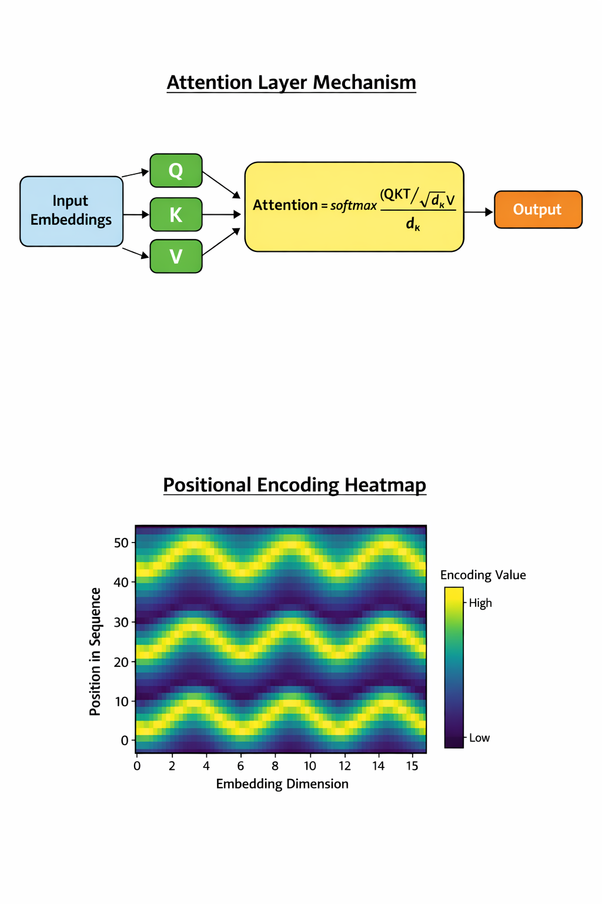

# Task 2: Transformer Networks in Cybersecurity

## 1. Introduction to Transformer Architecture
The Transformer is a deep learning architecture that relies on the **Self-Attention mechanism** to process sequential data. Unlike traditional models that process data word-by-word, the Transformer processes entire sequences at once. This parallelization makes it significantly more efficient for analyzing the massive datasets found in modern cybersecurity environments.

### Attention Layer and Positional Encoding Visualization
Below is the visualization of the internal mechanisms of the Transformer, showing how the Attention mechanism (Query, Key, Value) works alongside the Positional Encoding heatmap.

### Technical Mechanism
The core of the architecture is the **Scaled Dot-Product Attention**:
$$\text{Attention}(Q, K, V) = \text{softmax}\left(\frac{QK^T}{\sqrt{d_k}}\right)V$$

Since Transformers process all data simultaneously, they use **Positional Encoding** to understand the order of sequences, often represented mathematically as:
$$PE_{(pos, 2i)} = \sin(pos / 10000^{2i/d_{model}})$$

## 2. Applications in Cybersecurity
Transformers provide superior defense capabilities in several key areas:

* **Intrusion Detection Systems (IDS):** By treating network traffic as a sequence, Transformers can detect sophisticated, slow-moving attacks that occur over long periods.
* **Malware Analysis:** They analyze assembly instructions or API calls as "language" to identify malicious intent even in obfuscated code.
* **Phishing Detection:** Natural Language Processing (NLP) models based on Transformers identify social engineering tactics in emails with high precision.
* **Log Anomaly Detection:** They scan millions of system log lines to learn "normal" behavior and flag deviations that indicate a breach.

## 3. Conclusion
The Transformer’s ability to handle long-range dependencies and massive data volume makes it a critical tool for proactive cyber defense.